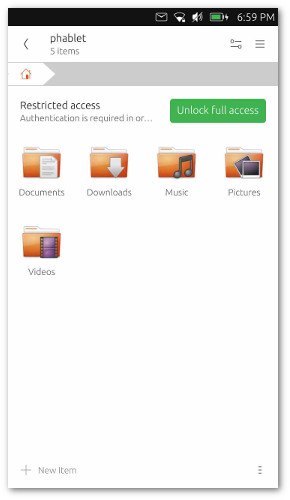

# File Manager application for Ubuntu Touch
[](https://translate.ubports.com/projects/ubports/filemanager-app) [](https://github.com/ubports/filemanager-app/blob/master/CONFIG.GPL) [](https://github.com/ubports/filemanager-app/issues)



## Getting Started

### Installing

Latest stable version of UBports File Manager app is available on [OpenStore](https://open.uappexplorer.com/app/com.ubuntu.filemanager). Currently, stable releases are built from the `master` branch.

### Building from scratch

We support Clickable as a standardized way to compile Ubuntu Touch application.

One of the main driving factors behind switching over this new tool is the better support cross distro.
It's a unified CLI tool that leverages all the Docker goodies, and allows us to build, test, and install .click applications on Ubuntu Touch and any GNU/Linux distribution.

To build and run filemanager-app on your Ubuntu Touch device, ensure Clickable is installed on your machine.

On Ubuntu:

```
  $ sudo apt-add-repository ppa:bhdouglass/clickable
  $ sudo apt update
  $ sudo apt install clickable
  $ clickable setup-docker
```

On other GNU/Linux distros you need to install the Git version. Please refer to the official [Clickable install guide](https://github.com/bhdouglass/clickable/blob/master/README.md) for installing the tool on your system.

`git` is also required in order to build a valid `.click` package.

Once Clickable is initialized on your system:

```
  $ git clone https://github.com/ubports/filemanager-app.git
  $ cd filemanager-app
  $ clickable
```

This command will build filemanager-app inside an Ubuntu 15.04 Docker container.
It will also create a .click package for Ubuntu Touch, and try to install it on your device if plugged to your PC.

__NOTE__: Due to the particular build configuration, `filemanager-app` is not currently buildable for a desktop target
  
By default, clickable executes the following sub-commands: `kill clean build click-build install launch`

For all the options available, please refer to the [Clickable docs](http://clickable.bhdouglass.com/en/latest/).  
  
## Contributing

Read [CONTRIBUTING.md](/CONTRIBUTING.md) for details on all the processes activated within the project.

All the activities are subject to our [CODE_OF_CONDUCT.md](/CODE_OF_CONDUCT.md).

## Contact & Support

Read [SUPPORT.md](/SUPPORT.md) for details on how to get in touch with us.


## Acknowledgments

`ubports/filemanager-app` would not exist without the contributions from several people and communities.

Here is a non-exhaustive list of people and projects that made it possible:

- Arto Jalkanen, Michael Spencer, and Carlos Mazieri, who originally maintained and contributed to the application as part of the "Ubuntu Core Apps" project.
- The Ubuntu and [UBports translators](https://translate.ubports.com/stats/), for their great contribution
- The Nemo Mobile community, and Robin Burchell, who originally wrote the `folderlistmodel` plugin used by the application
- The Ubuntu community

The list of all-time contributors is available on the [GitHub Insights](https://github.com/ubports/filemanager-app/graphs/contributors) page. A big thank goes to them as well.
